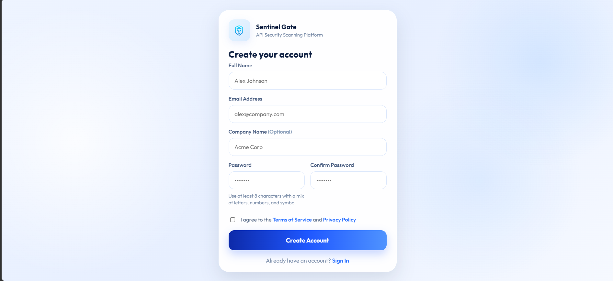
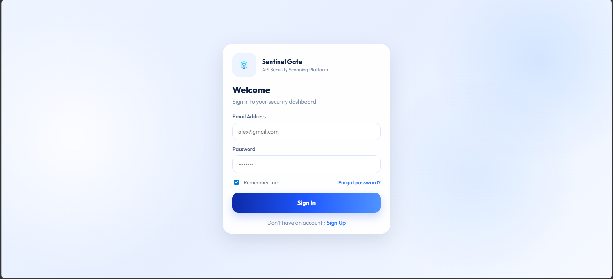
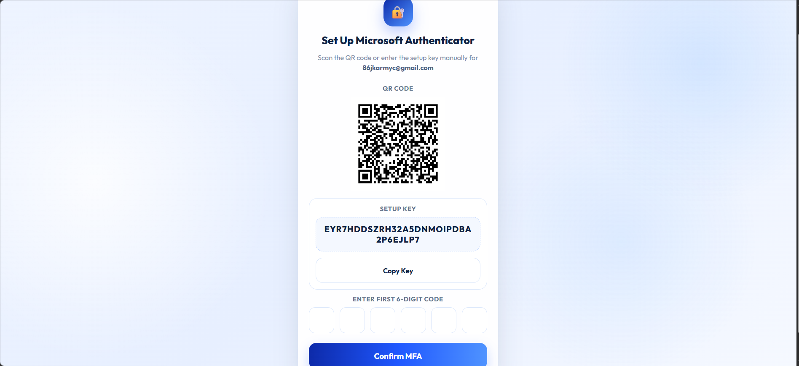
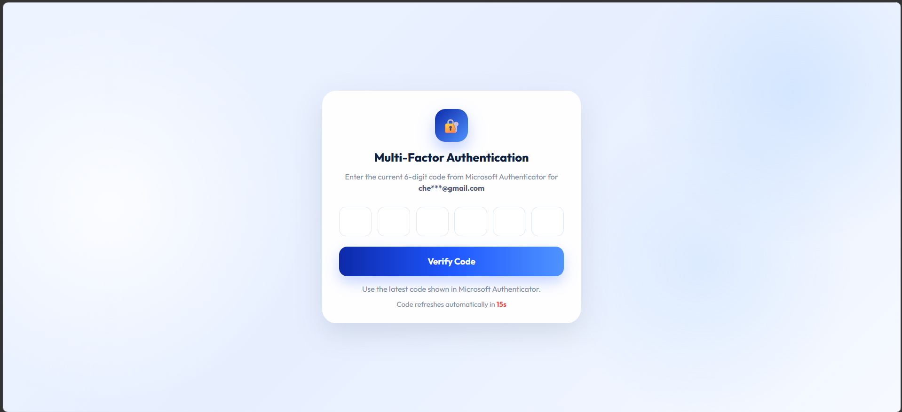
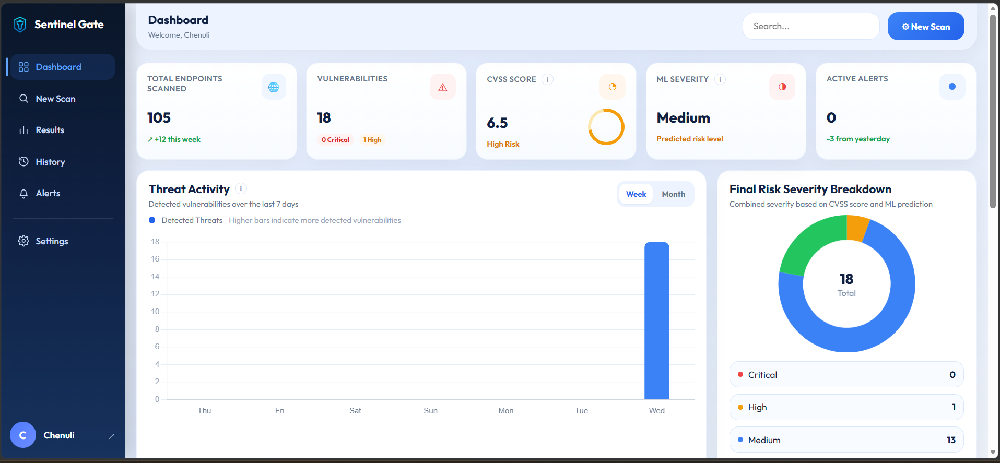
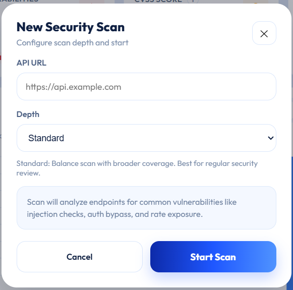
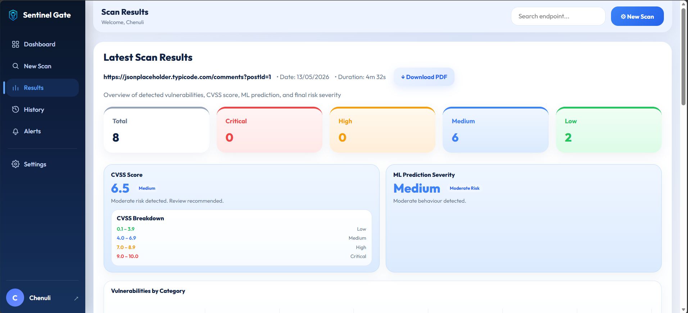
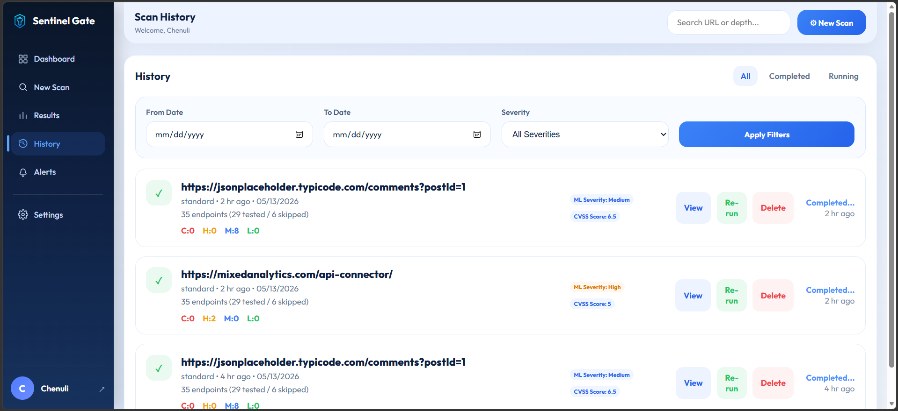
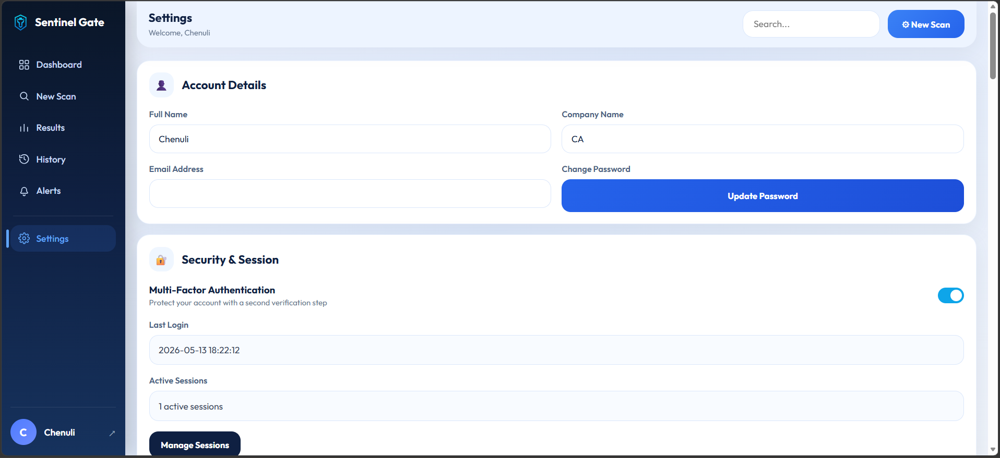
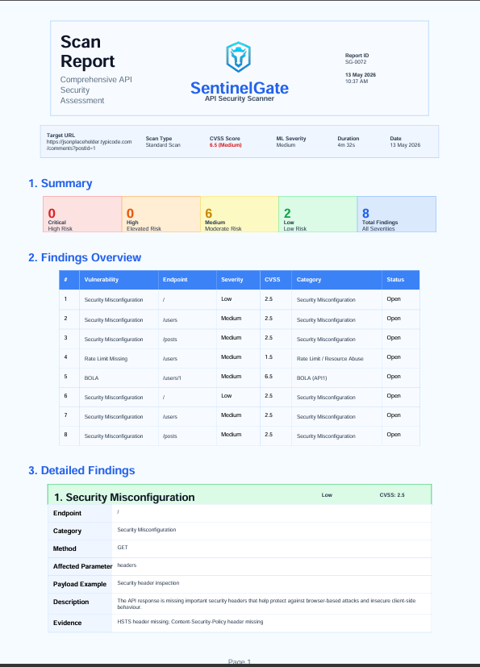

# SentinelGate – Automated API Security Scanner

SentinelGate is a web-based API security scanning platform developed to help small and medium-sized businesses identify vulnerabilities in APIs using automated security analysis.

The platform performs vulnerability scanning, attack simulation, CVSS-based risk scoring, and machine learning-based severity prediction using the OWASP API Security Top 10 framework.

---

# Features

- Automated API vulnerability scanning
- OWASP API Top 10 detection
- SQL Injection simulation
- Authentication bypass testing
- Rate limit testing
- CVSS risk scoring
- Machine learning severity prediction
- Real-time dashboard
- MFA authentication
- Session management
- Security alert system
- PDF security report generation
- Scan history tracking

---

# System Architecture

```text
Frontend (React)
        ↓
Backend API (Flask)
        ↓
PostgreSQL Database
        ↓
ML Severity Prediction Engine
```

---

# Screenshots

## Register Page


## Login Page


## Authenticator Setup


## MFA Setup


## Dashboard


## New Scan


## Results


## History


## Settings


## PDF Report



